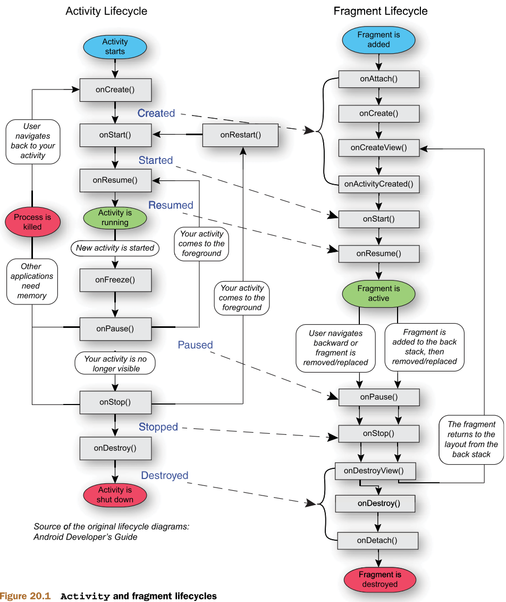

## Yandex Practicum
# Activity backstack

---


---

###  Способы изменить режим с помощью AndroidManifest.xml `<activity>`:
* **launchMode**
  * _standard_ - A-B-C-D-D
  * _singleTop_ - если такая уже в top, то onNewIntent(), 
  <br>A-B-C-D-D, A-B-C-D-B
  * _singleTask_ - если такой нет, то создаётся новый task,
    <br>если есть - onNewIntent(), все активити, что были сверху - уничтожаются
  * _singleInstance_ - как _singleTask_, но новый активити будут запущены в новом таске
  * _singleInstancePerTask_ - как _singleTask_, но могут быть разные инстансы в разных тасках, 
  <br>если FLAG_ACTIVITY_MULTIPLE_TASK
* **taskAffinity**
* **allowTaskReparenting**
* **clearTaskOnLaunch**
* **alwaysRetainTaskState**
* **finishOnTaskLaunch**

---

### С помощью Intent:
```kotlin
startActivity(
  Intent(this, ActivityA::class.java)
    .addFlags(FLAG_ACTIVITY_NEW_TASK)
)'''
```

* FLAG_ACTIVITY_NEW_TASK - как _singleTask_
* FLAG_ACTIVITY_CLEAR_TOP - ищет в таске создаваемое Activity. Если находит, то открывает, а все, что выше – закрывает
* FLAG_ACTIVITY_SINGLE_TOP - как _singleTop_
* FLAG_ACTIVITY_EXCLUDE_FROM_RECENTS
* FLAG_ACTIVITY_MULTIPLE_TASK
* FLAG_ACTIVITY_RESET_TASK_IF_NEEDED
* FLAG_ACTIVITY_NEW_DOCUMENT
* ...


finishAndRemoveTask()

---

adb shell dumpsys activity activities | grep ActivityRecord{

---

onBackPressed() - deprecated

```kotlin 
    onBackPressedDispatcher.addCallback(this, object : OnBackPressedCallback(true) {
      override fun handleOnBackPressed() {
        ...
      }
    })
```

---

# Фрагменты

Можно добавлять в активити c помощью:
* `<fragment>` (не рекомендуется)
* `<FragmentContainerView>`
*  supportFragmentManager.beginTransaction()


вариант 1
```kotlin
        supportFragmentManager.beginTransaction()
            .add(R.id.fragment_container_view, CitiesFragment())
            .commit()
```

вариант 2
```kotlin
       supportFragmentManager.commit {
            replace<Fragment2>(R.id.fragmentContainerView)
       }
```


---

Transaction: 
* add
* replace
* hide
* show
* attach
* detach

```kotlin
    companion object {
        const val DATA_KEY = "DATA_KEY"
        
        fun newInstance(someId: Int) = FragmentA().apply {
            arguments = bundleOf(DATA_KEY to someId)
        }
    }


  val someId = requireArguments().getInt(DATA_KEY)
```
```kotlin
  val args = bundleOf("arg", "value")
  supportFragmentManager.commit {
    setReorderingAllowed(true)
    add<ExampleFragment>(R.id.container, args = args)
  }
```
---
onSaveInstanceState()

retainFragment
commitAllowStateLoss()

setReorderingAllowed(true)
addToBackStack - всегда с setReorderingAllowed

Multi-backstack

Nested Fragment: parentFragment, childFragmentManager, parentFragmentManager

setFragmentResultListener()

FragmentDialog

---
### FragmentFactory

```kotlin
class MyFragmentFactory(
  private val dependency: Dependency
) : FragmentFactory() {
  
  override fun instantiate(classLoader: ClassLoader, className: String): Fragment {
    return when(className) {
      FirstFragment::class.java.name -> FirstFragment(dependency)
      SecondFragment::class.java.name -> SecondFragment()
      else -> super.instantiate(classLoader, className)
    }
  }
}
```
до super.onCreate() или в блоке init:
```kotlin
supportFragmentManager.fagmentFactory = MyFragmentFactory(Dependency())
```

---
### Fragment result

```kotlin
// MainActivity
supportFragmentManager.commit { replace<InnerFragment>(R.id.container) }
supportFragmentMananger.setFragmentResultListener("Result key", this) { key, bundle ->
// handle result
}

// InnerFragment
parentFragmentMananger.setFragmentResult("Result key", Bundle())
```